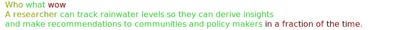

# Call for Code Solution Starter - Clean Water and Sanitation

  

Use this starter kit to understand how to technology can improve access to clean drinking water, reduce water waste, protect natural resources and more. Jump-start your own solution with tools and resources from our experts.

Water is the natural resource that is most threatened by climate change and a prerequisite for life on earth. Three billion people throughout the world still lack access to safely managed water and sanitation services and basic handwashing facilities at home, which are critical to preventing the spread of COVID-19 and other diseases. In least developed countries, nearly three-quarters of the population lack access to clean water and sanitation services.

## Contents

1. [Short description](#short-description)
1. [Demo video](#demo-video)
1. [The architecture](#the-architecture)
1. [Getting started](#getting-started)
1. [Contributing](#contributing)
1. [Versioning](#versioning)
1. [Authors](#authors)
1. [License](#license)
1. [Acknowledgments](#acknowledgments)

## Short description

### What's the problem?

tbd

### How can technology help?

tbd

### The idea

To encourage optimal water choices by consumers and local governments and incentivize water sustainability, we propose devising and implementing an omnichannel API for water data collection and dissemination.

This would be a centralized way to access and record:

- Geo-location of sustainable water sources
- Simplify coordination and funding for water construction projects
- Educational tools to support water sustainability and clean water access
- Enable transparent water usage, cleanliness results and site to site comparison
- Access to plain language case studies and legislation

We are initially focusing on the development of a starter kit that will enable these channels to be developed to their fullest potential.

### The Hills 

#### Hill 1 

- Verification of identity & community residency
- Badge system based on number of events held/organized
- Way to measure impact by event (attendees, sanitation goals)

#### Hill 2

- Data source of approved contractors, experts & reviews
- Workflow to manage requisitions
- Means to add data

#### Hill 3

- GPS Location Data for water sources relative to user location
- Data source to manage GPS data
- API to access data

#### Hill 4

- Water analysis technology (IOT)
- Track & trace
- Publicity of results & water source to report mapping
- Pollution source remediation & containment

#### Hill 5

- Gamification & Badging
- Embedded Virtual Whiteboard
- Technology to test clean water
- Repository for clean water resources & assessment
- Connect with other communities & learn from water use experiences

#### Hill 6

- Maps of surface water, aquifers, rainfall, watersheds relating to user location
- Lab test results of water quality upstream & downstream
- Water flow rate sensors to monitor household irrigation

#### Hill 7

- Sensor Data
- Automated analytical analysis
- Historic data on local rainfall
- Historic comparison of color of surface water over time from satellite imagery
- Rainfall forecast

#### Hill 8

- Natural language processing
- Text Summarization
- Document management

## Demo video

## The architecture

1. The user navigates to the site and uploads a video file. [Learn how to build apps on the IBM Cloud](#platform-development).
2. Watson Speech to Text processes the audio and extracts the text. [Learn about IBM artificial intelligence](#artificial-intelligence).
3. Watson Translation (optionally) can translate the text to the desired language. [Learn about IBM artificial intelligence](#artificial-intelligence).
4. The app stores the translated text as a document within Object Storage. [Learn about IBM data science](#data-science).

## Getting started

You can create a solution based on the proposed solution architecture above by exploring the following resources on the [IBM Developer](https://developer.ibm.com/) site.

### Resources

#### Mapping APIs

- [HERE Technologies API](https://developer.here.com)
- [Draw GeoJSON maps](http://geojson.io) 
- [Collection of zip code boundrary files for each of the 50 US states](https://github.com/OpenDataDE/State-zip-code-GeoJSON)

#### Artificial intelligence

Use AI to create apps that accelerate, enhance, and scale the human experience.

* [Link 1](https://developer.ibm.com/callforcode/technical-library/)

#### Data science

Analyze structured and unstructured data to extract knowledge and insights related to urgent issues.

* [Link 1](https://developer.ibm.com/callforcode/technical-library/)

#### Internet of Things

Collect and analyze device sensor data to take corrective or preventative action automatically.

* [Integrate Watson IoT with HERE Tracking](https://developer.ibm.com/tutorials/connect-watson-iot-here-tracking-manage-track-devices-real-time/)

#### Platform development

Identify the right environment, software, and runtime to power and scale your solution.

* [Link 1](https://developer.ibm.com/callforcode/technical-library/)

#### Data sets

These public data sets provide information on the problem.

- [USGS Watershed maps](https://waterdata.usgs.gov/blog/nldi-intro/)
- [Aquagenuity API provides water quality reports for many USA ZipCodes](https://aquagenuity.com/drinking-water-database/drinking-water-database)
- 
- 
-  

#### NGO documents

These are the go-to documents for measuring impact and progress against the key issue.

* [Link 1](https://developer.ibm.com/callforcode/technical-library/)

## Contributing

Please read [CONTRIBUTING.md](CONTRIBUTING.md) for details on our code of conduct, and the process for submitting pull requests.

## Contributors

* Mateo Bozzini
* Muralidhar Chavan
* Christoph Gorder - Expert
* Romeo Kienzler
* Mark Meiklejohn
* David O'Hara
* Karla Readshaw
* Niraj Swarmi - Expert
* John Walicki

## License

This starter kit is licensed under the Apache 2 License - see the [LICENSE](LICENSE) file for details

## Acknowledgments

* [Charity Water](https://www.charitywater.org/global-water-crisis)
* [Nature Conservancy](https://www.nature.org/en-us/what-we-do/our-priorities/provide-food-and-water-sustainably/)
