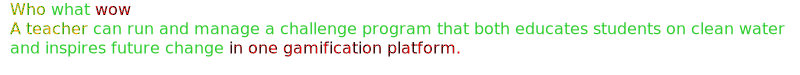
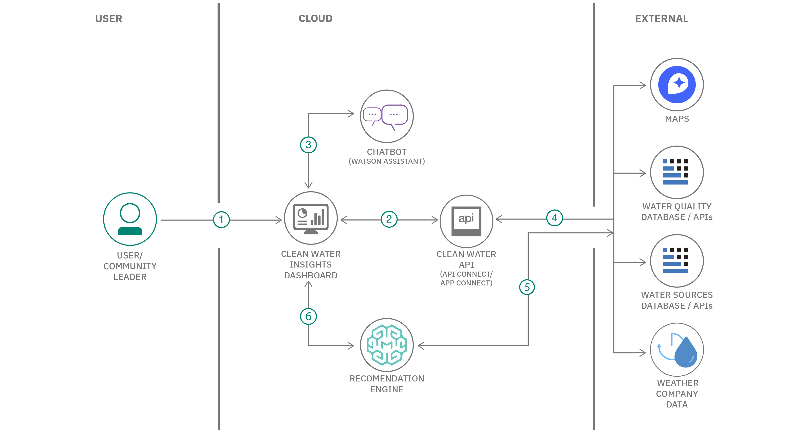

# Call for Code solution starter kit: Clean water and sanitation

  

Water is the natural resource that is most threatened by climate change, and more than half of the world does not have access to safe sanitation services. Use this starter kit to understand how technology can improve access to clean drinking water, reduce water waste, and protect natural resources. The starter kit provides tools and resources from our experts to help you jump-start your own solution.

## Contents

1. [Short description](#short-description)
1. [Video](#video)
1. [The architecture](#the-architecture)
1. [Getting started](#getting-started)
1. [Contributing](#contributing)
1. [Acknowledgments](#acknowledgments)

## Short description

This starter kit can help you begin your Call for Code solution. The starter kit pulls together resources to help you and your team use technology to create applications to tackle clean water and sanitation issues around the world.

### What's the problem?

According to the [World Health Organization](https://www.who.int/news/item/18-06-2019-1-in-3-people-globally-do-not-have-access-to-safe-drinking-water-unicef-who), 2.2 billion people around the world do not have safely managed drinking water services, 4.2 billion people do not have safely managed sanitation services, and 3 billion people lack basic handwashing facilities. These services are critical in preventing the spread of COVID-19 and other diseases. Even in areas that have these services, there are vast inequalities in the accessibility, availability, and quality of the services. 

UNICEF is urgently appealing for funding and support to reach more children with basic water, sanitation, and hygiene facilities, especially those children who are cut off from safe water because they live in remote areas, in places where water is untreated or polluted, or because they are without a home, living in a slum or on the street.

### How can technology help?

From intelligent solutions for small farmers to recycling showers, technology can make a significant impact on the availability of water and its consumption. IBM provides various technologies such as IoT, Watson, and blockchain. [IBM Water Management as a Service platform](https://www.ibm.com/thought-leadership/water/) can monitor water resources in real time. Through this cloud-based platform, IBM is helping to improve the management of water resources.

Additional ways Water Management as a Service can help:

- Creating a database and [interactive map](https://wmaasp.mybluemix.net/sensor-overview) to help locate and maintain the water points across the counties
- Collecting water usage, breakage, and repair data from boreholes that are monitored by SweetSense
- Delivering tickets to repair and maintenance teams who can respond to failures and repair the boreholes

### The idea

To encourage optimal water choices by consumers and local governments and to incentivize water sustainability, we propose devising and implementing an API for water data collection and dissemination. With an API, you could have a centralized way to:

- Query geolocations of sustainable water sources
- Simplify coordination and funding for water construction projects
- Explore educational tools to support water sustainability and clean water access
- Enable transparent water usage, cleanliness results, and site-to-site comparison
- Access plain language case studies and legislation

### Solution ideas

This section provides several examples that you and your team can use to jump-start your solution ideas. The following ideas are examples only, so feel free to brainstorm with your team to create your own original ideas and solutions. For example, the 2020 Call for Code Grand Prize winner, [Agrolly](https://developer.ibm.com/blogs/agrolly/) created a solution that uses IBM Cloud Object Storage, IBM Watson Studio, IBM Watson Assistant, and The Weather Company technologies to execute climate risk assessments, which allows farmers with less resources available to them to still make more educated decisions, obtain the necessary financing, and improve their economic outcome.

In the following examples:

#### Idea 1

Essential technologies needed:

- Verification of identity and community residency
- Badge system that is based on the number of events held or organized
- Measuring the impact by event (for example, attendees or sanitation goals)

#### Idea 2

Essential technologies needed:

- Data source of approved contractors, experts, and reviews
- Workflow to manage requisitions
- Adding data

#### Idea 3

Essential technologies needed:

- GPS location data for water sources relative to user location
- Data source to manage GPS data
- API to access data

#### Idea 4

Essential technologies needed:

- Water analysis technology (IoT)
- Track and trace
- Publicity of results and water source to report mapping
- Pollution source remediation and containment

#### Idea 5

Essential technologies needed:

- Gamification and badging
- Embedded virtual whiteboard
- Technology to test clean water
- Repository for clean water resources and assessment
- Connect with other communities and learn from water use experiences

#### Idea 6

Essential technologies needed:

- Maps of surface water, aquifers, rainfall, and watersheds relating to user location
- Lab test results of water quality upstream and downstream
- Water flow rate sensors to monitor household irrigation

#### Idea 7

Essential technologies needed:

- Sensor data
- Automated analytical analysis
- Historic data on local rainfall
- Historic comparison of color of surface water over time from satellite imagery
- Rainfall forecast

#### Idea 8

Essential technologies needed:

- Natural language processing
- Text summarization
- Document management

## Video

## The architecture

1. The user or community leader accesses a Clean Water Insights Dashboard.
1. The insights dashboard requests the Clean Water API for data that the user wants (including queries made on a chatbot).
1. The user can converse with a chatbot to get necessary information, and the insights dashboard can act as an orchestration application for the chatbot.
1. The Clean Water API component retrieves the required data from various sources and aggregates them as necessary.
1. A machine learning module uses the data sources as a corpus to build a recommendation model and hosts that model.
1. The Clean Water Water Insights Dashboard can get recommendation and prediction information from a recommendation engine.

## Getting started

You can create a solution based on the proposed solution architecture by exploring the following resources on [IBM Developer](https://developer.ibm.com/).

### Resources

Use the following resources to help you identify a topic and create your own solution.

#### Tutorials

- [Build a water quality dashboard with GeoJSON and Node-RED](https://developer.ibm.com/tutorials/build-a-water-quality-dashboard/) - Display USGS watershed maps on a Node-RED dashboard with water quality reports. Query the watershed area maps of the Ridgewood, New Jersey and Atlanta, Georgia watersheds using the USGS Hydro Network-Linked Data Index, and plot the water basins and rivers on a Node-RED dashboard.
- [Building integrations with event-driven flows or flows for APIs](https://developer.ibm.com/tutorials/building-integrations-with-app-connect/) - Learn how to create a fully integrated application using IBM App Connect. IBM App Connect, which is a key component of the IBM Cloud Pak for Integration platform (and available for free on IBM Cloud as a SaaS offering), showcases the agility of integrating applications on the cloud.
- [Analyzing geospatial environment data](https://developer.ibm.com/tutorials/analyzing-geospatial-environment-data/) Learn how to use [JupyterLab](https://jupyterlab.readthedocs.io/en/latest/), the [ElyraAI](https://elyra.readthedocs.io/en/latest/) Pipeline Editor and the [CLAIMED](https://arxiv.org/abs/2103.03281) component [library](https://github.com/elyra-ai/component-library) to use open climate data for computing future trends

#### Platform development

Identify the right environment, software, and runtime to power and scale your solution.

- [Technical library](https://developer.ibm.com/callforcode/technical-library/)
- [Watson Studio](https://www.ibm.com/cloud/watson-studio)
- [Watson IoT](https://www.ibm.com/internet-of-things)
- [Watson Machine Learning](https://www.ibm.com/cloud/machine-learning)

#### Mapping APIs

- [HERE Technologies API](https://developer.here.com)
- [Draw GeoJSON maps](http://geojson.io)
- [Collection of zip code boundrary files for each of the 50 US states](https://github.com/OpenDataDE/State-zip-code-GeoJSON)

#### Artificial intelligence

Use AI to create apps that accelerate, enhance, and scale the human experience.

- [Technical library](https://developer.ibm.com/callforcode/technical-library/)

#### Data science

Analyze structured and unstructured data to extract knowledge and insights related to urgent issues.

- [Technical library](https://developer.ibm.com/callforcode/technical-library/)

#### Internet of Things

Collect and analyze device sensor data to take corrective or preventative action automatically.

- [Integrate Watson IoT with HERE Tracking](https://developer.ibm.com/tutorials/connect-watson-iot-here-tracking-manage-track-devices-real-time/)
- [Build a hyper-local weather dashboard: Use The Weather Company's APIs to build a Node-RED weather dashboard](https://developer.ibm.com/tutorials/collect-display-hyperlocal-weather-data-from-a-pws-cfc-starter-kit-1/)
- [Analyze IoT ESP8266 sensor data](https://developer.ibm.com/technologies/iot/tutorials/connect-a-soil-sensor-send-data-to-the-cloud-cfc-starter-kit-1)

#### Data sets

These public data sets provide information on the problem.

- [USGS watershed maps](https://waterdata.usgs.gov/blog/nldi-intro/)
- [Aquagenuity API provides water quality reports for many USA zip codes](https://aquagenuity.com/drinking-water-database/drinking-water-database)
- [A large collection of data sets, topics include climate, weather, and agriculture](https://github.com/awesomedata/awesome-public-datasets)
- [Data collections that include atmosphere, ocean, land, and flood data, both current and historical](https://www.nccs.nasa.gov/services/data-collections)
- [Platform for organizing and presenting variables and indicators on water resources and their use](http://www.fao.org/aquastat/statistics/query/index.html)
- [Met Office data feeds in a format that is suitable for application developers.](https://www.metoffice.gov.uk/services/data/datapoint)
- [Met Office on AWS Earth](https://registry.opendata.aws/uk-met-office/)
- [Yahoo Weather API for your apps](https://developer.yahoo.com/weather/)

#### NGO documents

These are the go-to documents for measuring impact and progress against the key issue.

- [Sendai Framework Priority 4: Build Back Better](https://www.youtube.com/watch?v=mRTlS3ZfljM)
- [Open data in the agricultural sector](https://www.europeandataportal.eu/en/highlights/open-data-agricultural-sector)

## Contributing

Please read about [contributing](CONTRIBUTING.md) to this repository for details on our code of conduct and the process for submitting pull requests.

## Contributors

- [Dr. David O’Hara](https://www.linkedin.com/in/david-o-hara/), Chair and Professor of Philosophy and Environmental Studies, and Director of Sustainability and Environmental Studies, Augustana University
- [Dr. Mark L. Meiklejohn](https://www.linkedin.com/in/markmeiklejohn/), Senior Software Engineer, JP Morgan (Suisse)
- [Karla Readshaw](https://www.linkedin.com/in/karlareadshaw/), Program Manager, Education at Intuit  
- [Romeo Kienzler](https://developer.ibm.com/profiles/romeo.kienzler/), IBM Developer Advocate, Data science 
- [Muralidhar Chavan](https://developer.ibm.com/profiles/muralidhar.chavan/), IBM Developer Advocate, Artificial Intelligence 
- [Mateo Bozzini](https://developer.ibm.com/profiles/mbozzini/), IBM Developer Advocate, Platform Development
- [John Walicki](https://developer.ibm.com/profiles/walicki/), IBM Developer Advocate, IoT and Edge
- [Niraj Swami](https://www.linkedin.com/in/nirajswami/), Conservation Technology Strategy & Enablement, The Nature Conservancy
- [Christoph Gorder](https://www.linkedin.com/in/christoph-gorder-0745a2/), Chief Global Water Officer, charity: water

## License

This starter kit is licensed under the Apache 2 License - see the [LICENSE](LICENSE) file for details

- [Charity Water](https://www.charitywater.org/global-water-crisis)
- [Nature Conservancy](https://www.nature.org/en-us/what-we-do/our-priorities/provide-food-and-water-sustainably/)
